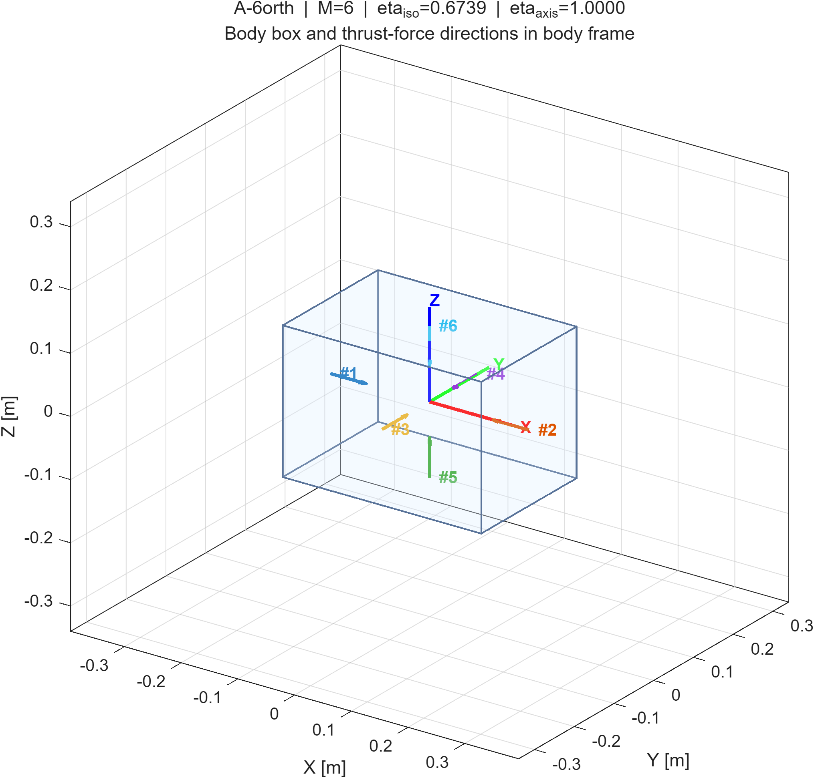
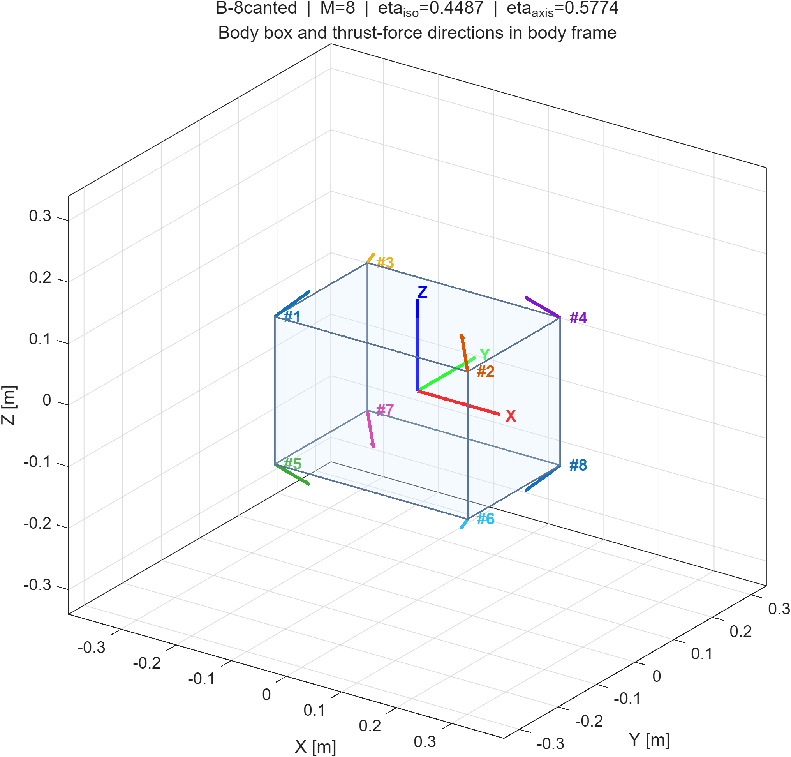
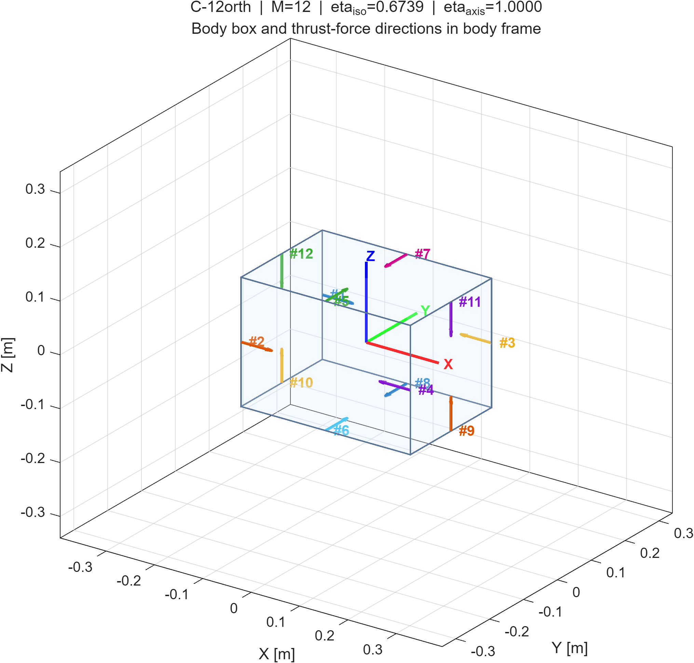
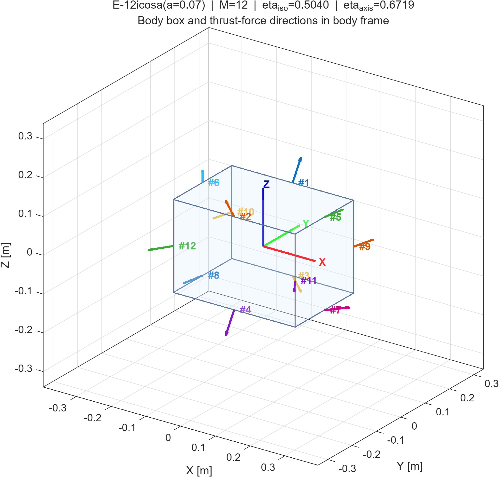
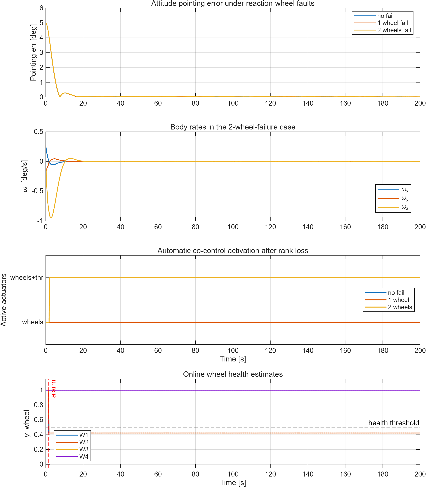
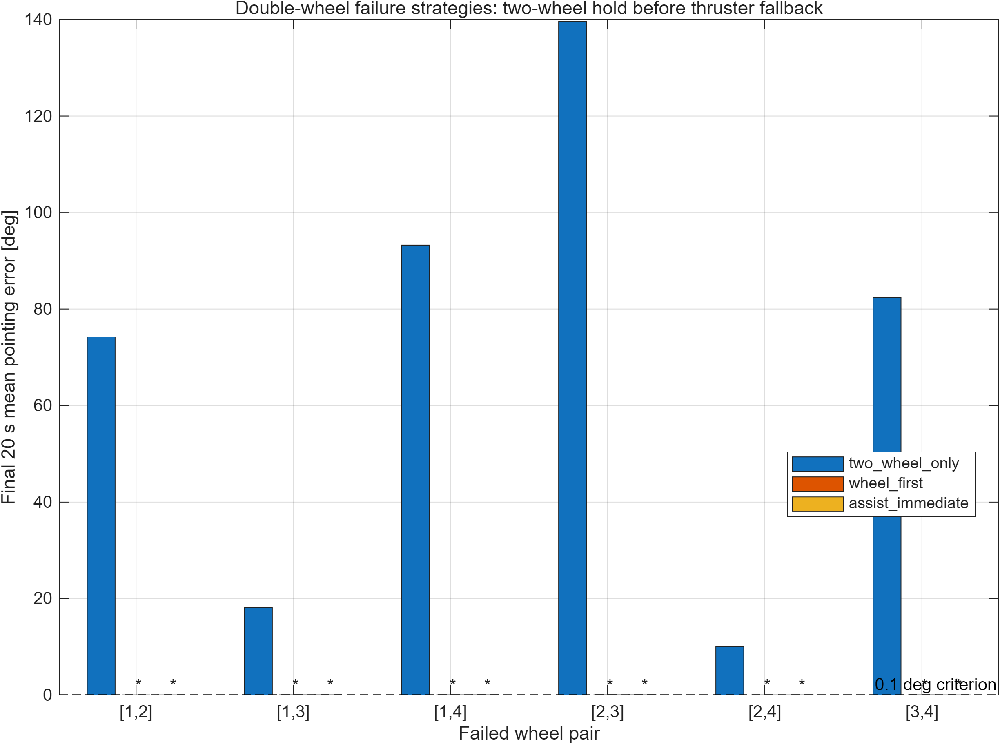
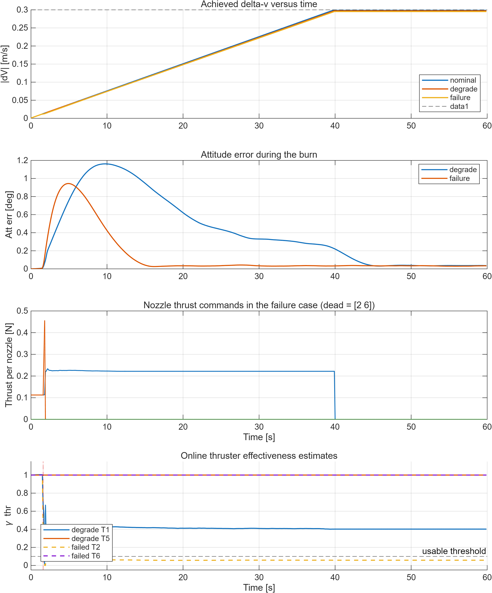
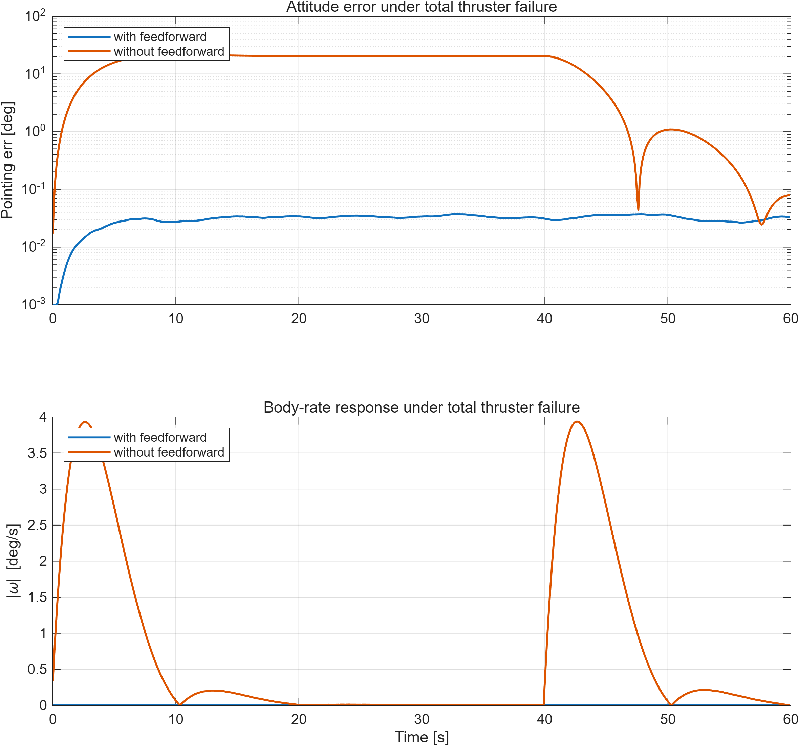
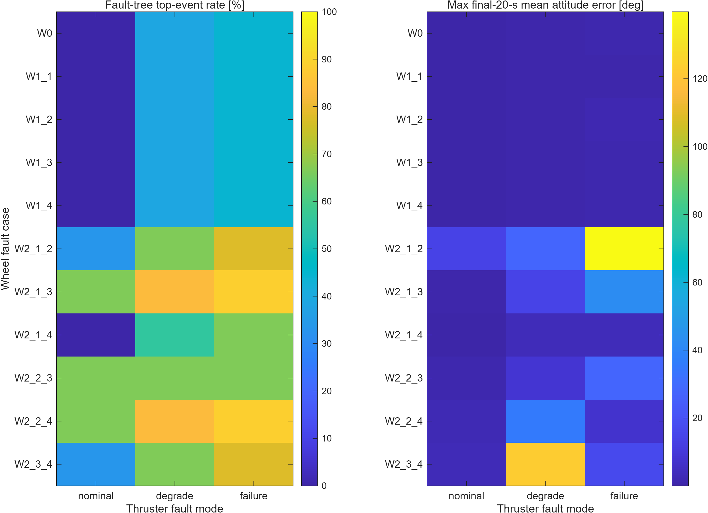

# 微小卫星执行机构容错控制项目交付说明书

> 项目名称：微小卫星执行机构容错控制算法开发  
> 交付对象：30 kg 微小卫星平台  
> 执行机构配置：4 台金字塔构型反作用飞轮 + 不超过 12 台反作用冷气推进器  
> 实现环境：MATLAB R2025b，纯 base toolbox 依赖  
> 对应需求文件：`research_target.md`

---

## 1 文档目的

本文档用于说明微小卫星执行机构容错控制项目的交付内容、技术方案、算法实现、仿真验证结果及需求符合性情况。文档面向项目验收、技术评审、后续工程化扩展及代码维护工作。

本文档覆盖以下内容：

1. 需求理解与技术指标分解；
2. 推进器构型方案设计、比较与选型依据；
3. 姿态容错控制算法与轨道机动容错控制算法；
4. MATLAB 实现结构及模块接口说明；
5. 典型故障工况下的仿真验证结果；
6. 交付边界、符合性说明及后续工作建议。

---

## 2 项目背景与任务目标

根据 `research_target.md`，本项目需完成微小卫星平台在执行机构故障条件下的姿态保持与轨道机动容错控制算法开发，主要目标如下：

1. 在推进器总数不超过 12 台的约束下，完成反作用推进器构型优化设计；
2. 实现“轨控不调姿”能力，即平台无需预先进行姿态机动即可实施指定方向轨道机动；
3. 形成具备冗余能力的推进器方案，保证单台推进器故障后平台总体姿轨控能力不失效；
4. 实现单台和双台反作用飞轮故障条件下的平台姿态稳定控制；
5. 实现多台推进器推力下降及多台推进器完全失效条件下的轨道机动控制；
6. 采用成熟、可解释、可维护的算法方法完成 MATLAB 工程实现。

本项目交付重点为“执行机构容错控制算法”。故障检测与隔离、完整轨道制导、在轨软件部署、硬件在环试验不属于本轮交付范围。

---

## 3 需求分解与技术指标

### 3.1 原始需求约束

项目需求可归纳为以下四类约束：

1. **配置约束**  
   推进器数量不超过 12 台，执行机构参数需保留接口，便于适配不同平台配置。
2. **功能约束**  
   平台需具备姿态保持与轨道机动控制能力，并在执行机构故障情况下维持基本控制功能。
3. **容错约束**  
   飞轮单台和双台故障、推进器多台推力下降和多台失效工况均需覆盖。
4. **工程约束**  
   算法应优先采用成熟方法，代码应模块化、接口清晰、可维护并具备较高注释覆盖率。

### 3.2 技术指标转换

为保证方案具备可设计性和可验证性，项目将需求转化为以下技术指标：

1. **推进器构型评价指标**
   - 单方向推进效率；
   - 各向同性平均效率；
   - 主轴方向推进效率；
   - 单喷嘴故障后平动可达性；
   - 标称工况下零寄生力矩轨控能力。
2. **姿态控制评价指标**
   - 正常工况下指向误差收敛性能；
   - 飞轮单故障工况下姿态保持性能；
   - 飞轮双故障工况下协同控制后姿态保持性能。
3. **轨道控制评价指标**
   - 推力下降工况下目标速度增量实现能力；
   - 推进器失效工况下目标速度增量实现能力；
   - 轨控过程中姿态扰动抑制能力。
4. **工程实现指标**
   - 模块化实现；
   - 参数化接口；
   - 算法与代码一一对应；
   - 控制分配显式考虑非负、失效、降额和饱和约束。

### 3.3 技术口径说明

针对需求中“单台推进器故障不影响姿轨控能力”的表述，本项目采用如下工程口径：

1. 单台推进器故障后，平台总体姿轨控能力仍应保留；
2. 故障后不强制要求剩余推进器单独继续实现严格零力矩纯平动；
3. 当故障几何导致推进器不可避免地产生寄生力矩时，允许飞轮进行协同补偿。

该口径与任务目标一致，也与本项目代码实现一致。

---

## 4 平台参数与建模基础

### 4.1 平台主要参数

| 项目 | 符号 | 数值 | 单位 |
|---|---|---:|---|
| 质量 | $m$ | 30 | kg |
| 尺寸 | $(2h_x,2h_y,2h_z)$ | $(0.350,0.240,0.240)$ | m |
| 转动惯量 | $J$ | $\mathrm{diag}(0.288,0.45025,0.45025)$ | kg·m² |
| 飞轮数量 | $N_w$ | 4 | 台 |
| 单飞轮最大力矩 | $T_w^{\max}$ | 0.02 | N·m |
| 推进器最大数量 | $M$ | 12 | 台 |
| 单推进器最大推力 | $F_{\max}$ | 0.5 | N |
| 星敏 1σ 噪声 | $\sigma_{\mathrm{star}}$ | 5 arcsec | - |
| 陀螺 1σ 噪声 | $\sigma_{\omega}$ | 0.01 | °/s |
| 陀螺常值偏置 | $b_\omega$ | 0.005 | °/s |
| 姿态 PD 比例增益 | $K_p$ | $0.15I_3$ | - |
| 姿态 PD 微分增益 | $K_d$ | $0.25I_3$ | - |

### 4.2 坐标与符号定义

所有矢量在体坐标系下表示。四元数采用 scalar-first 形式

$$
q=[q_0;\,q_v]^\top,\qquad \|q\|=1.
$$

对第 $i$ 台推进器，定义：

- 安装位置：$r_i\in\mathbb{R}^3$
- 推力方向单位矢量：$d_i\in S^2$
- 推力幅值：$F_i\ge 0$

则推进器系统对平台产生的总力与总力矩分别为

$$
\mathbf F = \sum_{i=1}^{M}F_i d_i,\qquad
\mathbf T = \sum_{i=1}^{M}F_i(r_i\times d_i).
$$

记

$$
D=[d_1,\dots,d_M],\qquad
B=[r_1\times d_1,\dots,r_M\times d_M],
$$

则有

$$
\begin{bmatrix}\mathbf F\\ \mathbf T\end{bmatrix}
=
\begin{bmatrix}D\\B\end{bmatrix}F.
$$

### 4.3 姿态动力学模型

平台姿态运动学与动力学建模如下：

$$
\dot q=\frac{1}{2}\Omega(\omega)q,\qquad
J\dot\omega=-\omega\times(J\omega)+T_{\mathrm{ctrl}}+T_{\mathrm{dist}}.
$$

数值积分采用四阶 Runge-Kutta 方法，积分步长为 `0.1 s`。

### 4.4 传感器与故障建模假设

1. 星敏感器姿态测量采用小角度白噪声模型；
2. 陀螺测量包含白噪声和常值偏置；
3. 飞轮和推进器故障状态由在线故障诊断模块估计，故障真值仅用于被控对象注入和结果评估；
4. 故障诊断模块采用执行机构命令、角速度和加速度测量进行健康度递推估计，控制分配不直接读取故障真值。

上述建模假设与本轮算法交付目标相匹配，能够支撑构型比选和控制方法验证。

---

## 5 技术方案总述

### 5.1 方案设计原则

本项目基线方案遵循以下原则：

1. 优先采用成熟、可解释的控制方法；
2. 标称工况优先保证“轨控不调姿”；
3. 故障工况优先保证平台总体姿轨控能力；
4. 控制分配应符合执行机构实际物理约束；
5. 代码实现应便于后续扩展和替换。

### 5.2 方法选型依据

本项目未采用模型预测控制、强化学习或复杂启发式优化作为基线方案，原因如下：

1. 飞轮姿态控制属于低维控制分配问题，使用伪逆与秩投影即可有效解决；
2. 推进器控制分配天然受非负约束，非负最小二乘更符合物理特性；
3. 故障工况要求算法具备明确的物理解释能力；
4. MATLAB 工程交付更适合使用成熟稳定、可直接复核的方法。

基于上述原则，本项目采用以下总体方案：

1. 推进器构型：`C-12orth` 十二喷嘴正交成对方案；
2. 姿态控制：PD 控制律 + 飞轮健康门控伪逆分配 + 秩亏投影；
3. 轨控分配：健康/降额约束下的非负最小二乘分配；
4. 协同控制：飞轮补偿推进器故障引起的寄生力矩，推进器补偿飞轮故障引起的缺失控制力矩。

### 5.3 控制架构

系统控制架构分为两条主链：

1. **姿态保持链**  
   传感器提供姿态与角速度测量，飞轮姿态控制器优先稳定平台；当飞轮故障导致三轴力矩不可完全生成时，推进器参与姿态协同补偿。
2. **轨道机动链**  
   制导模块给出目标速度增量方向后，推进器优先生成目标体力；若故障导致寄生力矩不可消除，则由飞轮以前馈方式补偿残余力矩。

该架构实现了标称工况与故障工况之间的职责分离，符合两类执行机构的物理特性。

---

## 6 推进器构型设计与选型说明

### 6.1 构型设计问题说明

推进器构型设计需要同时解决以下问题：

1. 保证目标方向机动能力；
2. 降低标称轨控过程中的寄生力矩；
3. 保证单喷嘴故障后总体姿轨控能力仍可维持；
4. 在 12 台以内完成构型布局。

因此，推进器构型设计既是几何问题，也是控制资源配置问题。

### 6.2 评价指标定义

#### 6.2.1 单方向推进效率

对单位目标方向 $u\in S^2$，定义标称工况下的推进效率为

$$
\eta(u)=\frac{\|\mathbf F(u)\|}{\sum_iF_i(u)},
\qquad
\text{s.t. } DF=\eta(u)\,u,\; BF=0,\; F\ge 0.
$$

该指标用于衡量总点火推力转化为目标方向有效推力的能力。

#### 6.2.2 各向同性平均效率

采用 Fibonacci 球面采样计算平均效率：

$$
\bar\eta \approx \frac{1}{N_s}\sum_{k=1}^{N_s}\eta(u_k),\qquad N_s=64.
$$

#### 6.2.3 主轴方向效率

主轴方向效率定义为

$$
\eta_{\mathrm{axis}}
=
\frac{1}{6}\sum_{k=1}^{6}\eta(\pm\hat e_k).
$$

该指标用于表征主轴方向机动任务下的推进利用水平。

#### 6.2.4 单喷嘴故障后的可达性

冗余性的工程判据设定如下：

1. 单喷嘴故障后，剩余推进方向仍覆盖三维平动空间；
2. 主轴方向机动能力不丢失；
3. 如故障后无法仅由推进器独立实现零寄生力矩，则允许飞轮补偿。

### 6.3 效率上界说明

对任意目标方向 $u\in S^2$，有

$$
\eta(u)\le \max_i(u^\top d_i)\le 1.
$$

该结论说明：

1. 若某方向上不存在严格对准喷嘴，则该方向不可能达到满效率；
2. 全部采用倾斜喷嘴的方案，其主轴方向效率必然受限。

该上界是推进器构型比较的重要理论依据。

### 6.4 候选构型说明

本项目比较以下四种候选构型：

1. `A-6orth`：六正交喷嘴方案；
2. `B-8canted`：八喷嘴倾斜方案；
3. `C-12orth`：十二喷嘴正交成对方案；
4. `E-12icosa`：十二喷嘴非正交全方位方案。

#### 6.4.1 `A-6orth`

该方案在 $\pm X,\pm Y,\pm Z$ 六个方向各布置 1 台喷嘴。其优点为结构最简、主轴效率高；缺点为任意关键方向仅有单台喷嘴，单点故障后对应方向机动能力丧失，不能满足容错要求。

#### 6.4.2 `B-8canted`

该方案通过倾斜安装获得一定方向冗余，但各主轴方向无严格对准喷嘴。依据效率上界，其主轴效率最高只能达到 $1/\sqrt 3\approx 0.5774$。在当前任务以主轴方向机动为主要工况的前提下，该方案推进效率偏低。

#### 6.4.3 `C-12orth`

该方案在六个主轴方向各布置两台共线喷嘴，并通过成对对称安装实现标称工况下的寄生力矩内消。当前实现中，Z 向喷嘴对布置于 ±X 面上的对称位置，使六个主轴方向的力臂都按成对抵消设计。方案特点如下：

1. 六个主轴方向均有严格对准喷嘴，主轴效率可达 1；
2. 标称同向点火可实现零寄生力矩轨控；
3. 单喷嘴故障后主轴机动能力仍保留；
4. 与飞轮协同时，故障后的寄生力矩可由飞轮补偿。

在当前需求框架下，若要求六个主轴方向均保持满效率且单喷嘴故障后方向能力仍不丢失，则每个方向至少需两台同向喷嘴，因此

$$
M\ge 6\times 2 = 12.
$$

因此，`C-12orth` 在当前问题设定下具有明确的下界意义。

#### 6.4.4 `E-12icosa`

该方案以正二十面体顶点方向为基础，通过参数微调得到较均匀的全方位方向覆盖。其特点如下：

1. 对任意斜向机动具有较好适应性；
2. 单喷嘴可天然产生姿态力矩，便于推进器辅助稳姿；
3. 但标称工况下寄生力矩较难完全消除；
4. 主轴效率低于 `C-12orth`。

该方案适合作为扩展构型储备，不作为本项目基线方案。

### 6.5 构型比选结果

2026 年 4 月 21 日在本地 MATLAB R2025b 环境运行 `main.m`，得到如下比选结果：

| 方案 | 喷嘴数 M | 单喷嘴故障冗余 | 各向平均效率 $\bar\eta$ | 主轴平均效率 | 评价 |
|---|---:|---|---:|---:|---|
| A-6orth | 6 | NO | 0.6739 | 1.0000 | 效率高，但不具备容错性 |
| B-8canted | 8 | YES | 0.4487 | 0.5774 | 冗余成立，但效率偏低 |
| C-12orth | 12 | YES | 0.6739 | 1.0000 | 基线最优方案 |
| E-12icosa(a=0.07) | 12 | YES | 0.5040 | 0.6719 | 扩展任务可选 |

### 6.6 选型结论

综合需求约束、效率指标、故障后能力保持和控制实现复杂度，确定 `C-12orth` 为本项目推进器基线构型。选型依据如下：

1. 满足不超过 12 台推进器的数量约束；
2. 在冗余构型中具有最高的平均效率；
3. 主轴方向保持满效率；
4. 标称工况下可实现零寄生力矩轨控；
5. 故障后平台总体姿轨控能力可通过飞轮协同得到保证。

---

## 7 姿态容错控制算法说明

### 7.1 姿态误差定义

设期望姿态为 $q_{\mathrm{cmd}}$，测量姿态为 $q_{\mathrm{meas}}$，则误差四元数定义为

$$
q_e = q_{\mathrm{cmd}}^{-1}\otimes q_{\mathrm{meas}}.
$$

取其矢量部并结合最短旋转路径约束，得到姿态误差向量 $\tilde q_v$。

### 7.2 姿态控制律

姿态控制采用 PD 控制律：

$$
T_{\mathrm{des}}
=
-K_p\tilde q_v - K_d\omega_{\mathrm{meas}} - T_{\mathrm{ff}},
$$

其中 $T_{\mathrm{ff}}$ 为已知残余力矩前馈补偿项。

该控制律满足以下要求：

1. 实现形式简单；
2. 参数物理含义明确；
3. 适合姿态保持工况；
4. 便于与执行机构分配逻辑解耦。

### 7.3 飞轮控制分配

设飞轮轴矩阵为 $W=[w_1,\dots,w_{N_w}]$，健康向量为 $h\in\{0,1\}^{N_w}$，则健康门控后的分配矩阵为

$$
W^{(h)} = W\,\mathrm{diag}(h).
$$

若 $\mathrm{rank}(W^{(h)})\ge 3$，则采用伪逆求解最小 2-范数分配：

$$
\tau^\star = (W^{(h)})^+T_{\mathrm{des}}.
$$

若 $\mathrm{rank}(W^{(h)})<3$，则说明剩余飞轮不能独立实现完整三轴姿态控制。此时通过 SVD 提取飞轮可达子空间投影器 $P_R$，先对期望力矩进行投影：

$$
T_{\mathrm{des}}^{\mathrm{proj}} = P_R T_{\mathrm{des}},
$$

再由伪逆求解飞轮分配，缺失部分交由推进器协同补偿。

### 7.4 飞轮故障容错逻辑

飞轮故障容错逻辑如下：

1. 正常工况下采用纯飞轮姿态控制；
2. 单飞轮故障时，飞轮健康门控后仍可通过伪逆完成三轴分配；
3. 双飞轮故障时，飞轮分配矩阵秩亏，系统自动切换为飞轮与推进器协同控制；
4. 协同控制模式由状态量 `mode` 记录：
   - `mode=1`：纯飞轮控制；
   - `mode=2`：飞轮与推进器协同控制。

该逻辑不依赖经验阈值切换，而是由飞轮分配矩阵的秩直接驱动，具有明确物理意义。

### 7.5 双飞轮失效后的两飞轮优先评估

参考 Zhang 等（2023）关于欠驱动航天器姿态容错的结论，双飞轮失效后不必在逻辑上直接等同于“必须立即使用推力器”。在满足零动量、剩余飞轮力矩裕度和初始状态约束的条件下，两台飞轮仍可能对三轴姿态产生稳定作用。

结合本项目需求边界，本报告仅在“飞轮完全失效”范围内引入该启示，不考虑飞轮效率下降、偏置故障或额外故障诊断问题。新增双飞轮失效后的三类策略：

1. `two_wheel_only`：仅使用剩余两台飞轮的可达力矩投影；
2. `wheel_first`：先运行两飞轮控制，若 30 s 滚动平均姿态误差超过 0.1°，再启用推力器补偿缺失力矩；
3. `assist_immediate`：双飞轮失效后立即进入飞轮 + 推力器协同控制。

该处理方式将“能否只靠两飞轮满足姿态保持精度”作为仿真判据，而不是先验假设。若两飞轮无法满足精度，则仍按 `research_target.md` 允许的方式切换到飞轮和推力器协同控制。

---

## 8 推进器容错控制算法说明

### 8.1 控制分配模型

给定期望体力 $F_d$ 与期望体力矩 $T_d$，定义目标向量

$$
b=\begin{bmatrix}F_d\\T_d\end{bmatrix}.
$$

推进器健康向量为 $h_i\in\{0,1\}$，推力降额系数为 $s_i\in[0,1]$。推进器分配问题建模为：

$$
\min_{F\ge 0}
\left\|
A^{(h,s)}F-b
\right\|^2 + \lambda^2\|F\|^2,
\qquad
0\le F_i\le s_i h_i F_{\max}.
$$

在实现中，通过增广矩阵形式调用 `lsqnonneg` 求解：

$$
F^\star
=
\arg\min_{F\ge 0}
\left\|
\begin{bmatrix}A^{(h,s)}\\\lambda I\end{bmatrix}F
-
\begin{bmatrix}b\\0\end{bmatrix}
\right\|^2.
$$

### 8.2 方法选型依据

推进器分配采用非负最小二乘的原因如下：

1. 喷嘴推力天然满足非负约束；
2. 失效喷嘴可直接通过健康门控置零；
3. 降额喷嘴可通过推力缩放表达；
4. 不可完全满足目标时，可自动给出最接近物理可实现约束的解。

相较于普通最小二乘或伪逆分配，NNLS 更符合推进器物理特性。

### 8.3 推力下降与失效处理

推进器故障在分配层面统一处理：

1. **完全失效**：健康标志置零，对应列不参与分配；
2. **推力下降**：健康标志保持有效，但最大推力上限按缩放系数降低；
3. **输出裁剪**：求解完成后按最大可用推力进行饱和限制。

该实现方式使控制算法能够统一覆盖正常、降额和失效三类状态。

---

## 9 协同控制策略说明

### 9.1 飞轮故障场景下的协同控制

当双飞轮故障导致飞轮可达力矩空间不足时，系统执行以下步骤：

1. 姿态环计算期望力矩 $T_{\mathrm{des}}$；
2. 飞轮分配器生成可达部分 $T_w$；
3. 差额力矩 $T_{\mathrm{miss}}=T_{\mathrm{des}}-T_w$ 输入推进器分配器；
4. 推进器以零净力优先方式输出姿态补偿力矩；
5. 平台进入协同控制模式。

该策略实现了飞轮故障后的姿态稳定能力维持。

### 9.2 推进器故障场景下的协同控制

轨道机动工况下，系统执行以下步骤：

1. 根据目标速度增量方向生成期望体力 $F_d$；
2. 推进器分配器优先完成目标合力分配；
3. 若因故障几何和非负约束导致零寄生力矩无法同时满足，则得到残余寄生力矩 $T_{\mathrm{thr,res}}$；
4. 飞轮姿态控制器将 $T_{\mathrm{thr,res}}$ 作为前馈项进行补偿；
5. 若该残余力矩会使飞轮分配进入饱和，或使单轮力矩占用超过预留裕度，则按 `100%/80%/60%/40%/30%/20%` 候选比例降低本步轨控推力，并相应延长燃烧时间，以慢速机动方式优先保持姿态稳定。

由此可实现“推进器主导轨控、飞轮主导姿态补偿、力矩裕度不足时降低轨控加速度”的职责划分。该策略不把固定燃烧时间作为硬约束，而是把执行机构力矩裕度作为轨控推力上限；当残余力矩超过当前飞轮可补偿能力时，算法牺牲机动速度而不是牺牲姿态稳定性。

### 9.3 寄生力矩不可消除性的说明

以 `C-12orth` 中 `+X` 方向一台喷嘴失效为例，若要求产生净 $+X$ 向合力并同时满足零 $Z$ 向力矩，则相关约束可写为

$$
\begin{cases}
F_1-F_3-F_4 = F_x>0,\\
-F_1-F_3+F_4 = 0.
\end{cases}
$$

由此得到

$$
F_3=-\frac{F_x}{2}<0.
$$

该结果表明，在故障几何和非负约束共同作用下，剩余推进器无法单独实现“目标合力 + 零寄生力矩”。因此，飞轮前馈补偿不是附加优化，而是故障轨控条件下的必要机制。

---

## 10 算法执行流程

项目交付算法整体执行流程如下：

1. 读取传感器姿态与角速度测量值；
2. 读取飞轮健康向量、推进器健康向量和推进器降额系数；
3. 根据任务模式区分姿态保持或轨道机动控制流程；
4. 姿态保持模式下优先执行飞轮控制分配，必要时调用推进器协同；
5. 轨道机动模式下优先执行推进器控制分配，并将残余寄生力矩传递给飞轮前馈补偿；
6. 对推进器残余力矩进行飞轮裕度检查，必要时降低本步推力并采用慢速燃烧完成同一目标 $\Delta v$；
7. 对所有执行机构命令执行健康门控与饱和限制；
8. 输出控制指令并记录模式状态、控制残差、姿态误差、推力比例与速度增量结果。

该流程各步骤边界清晰，诊断、任务管理和上层制导模块之间接口明确。

---

## 11 MATLAB 实现说明

### 11.1 模块组成

当前代码实现包含以下模块：

| 模块 | 功能说明 |
|---|---|
| `satellite_params.m` | 平台参数、执行机构参数、控制器参数和噪声参数定义 |
| `thruster_configurations.m` | 候选推进器构型生成与效率/冗余评估 |
| `attitude_dynamics.m` | 姿态动力学 RK4 积分 |
| `sensor_model.m` | 带噪姿态与角速度测量建模 |
| `wheel_attitude_controller.m` | 飞轮姿态控制律与故障分配 |
| `thruster_ft_allocation.m` | 推进器 NNLS 容错分配 |
| `sim_wheel_failure.m` | 飞轮故障场景仿真 |
| `sweep_double_wheel_failure.m` | 双飞轮失效组合与策略扫描 |
| `sim_thruster_fault.m` | 推进器故障场景仿真 |
| `sim_combined_fault.m` | 飞轮与推进器组合故障姿轨控仿真 |
| `sweep_fault_tree_analysis.m` | 组合故障矩阵扫掠与故障树结果汇总 |
| `main.m` | 方案比选、仿真调度与结果输出 |

### 11.2 工程特性

本项目代码具有以下工程特性：

1. 参数集中管理，便于平台迁移；
2. 控制分配接口明确，已接入在线执行机构故障诊断模块；
3. 算法过程与文档公式一一对应，便于复核；
4. 模块边界清晰，具备扩展与替换条件；
5. 纯 base toolbox 依赖，降低运行环境要求。

### 11.3 当前版本交付边界

当前交付版本不包含以下内容：

1. 硬件级故障检测与隔离算法及遥测接口；
2. 飞轮角动量长期累积与卸载策略；
3. 推进剂消耗引起的质心迁移建模；
4. 完整轨道制导闭环验证；
5. 硬件在环或半实物试验验证。

上述内容不影响本轮容错控制算法交付结论，但构成后续工程化深化方向。

---

## 12 仿真验证方案

### 12.1 仿真条件

仿真采用以下设置：

1. 积分步长：`0.1 s`
2. 姿态动力学：刚体模型 + RK4 积分
3. 传感器误差：
   - 星敏 `1σ = 5 arcsec`
   - 陀螺 `1σ = 0.01°/s`
   - 陀螺常值偏置 `0.005°/s`
4. 扰动力矩：小幅正弦与常值组合
5. 推进器基线构型：`C-12orth`

### 12.2 验证场景

本项目设置以下三类仿真场景：

1. **场景 1：飞轮故障姿态保持**
   - 无故障；
   - 1 台飞轮失效；
   - 2 台飞轮失效。
2. **场景 2：推进器推力下降轨控**
   - 在 `+X` 方向执行 `0.3 m/s` 目标速度增量；
   - 燃烧时间 `40 s`；
   - 推进器 `#1`、`#5` 推力下降至标称值的 `40%`。
3. **场景 3：推进器完全失效轨控**
   - 在 `+X` 方向执行 `0.3 m/s` 目标速度增量；
   - 推进器 `#2`、`#6` 完全失效；
   - 对比启用和不启用飞轮前馈补偿两种情况。

---

## 13 仿真结果与结果分析

### 13.1 构型比选结果

在本地 MATLAB R2025b 环境复核运行 `main.m`，得到如下构型评价结果：

| 方案 | 冗余 | 各向平均效率 | 主轴平均效率 | 说明 |
|---|---|---:|---:|---|
| A-6orth | 否 | 0.6739 | 1.0000 | 主轴效率高，但不满足容错要求 |
| B-8canted | 是 | 0.4487 | 0.5774 | 冗余成立，但推进效率偏低 |
| C-12orth | 是 | 0.6739 | 1.0000 | 综合表现最优 |
| E-12icosa(a=0.07) | 是 | 0.5040 | 0.6719 | 适合作为扩展方案 |

结果表明，`C-12orth` 在冗余构型中同时具有最高平均效率和满主轴效率，适合作为本项目基线方案。

### 13.2 飞轮故障姿态保持结果

飞轮故障场景复核结果如下（最新控制增益下复跑）：

| 工况 | 末段 20 s 平均误差 | 最大误差 | 控制模式 |
|---|---:|---:|---|
| 无故障 | 0.0256° | 0.0340° | 纯飞轮 |
| 1 台飞轮失效 | 0.0230° | 0.0293° | 纯飞轮 |
| 2 台飞轮失效 | 0.0210° | 0.0261° | 飞轮 + 推进器协同 |

结果说明：

1. 单飞轮失效不会导致姿态性能显著退化；
2. 双飞轮失效时，系统通过协同控制将姿态误差压到 `0.03°` 量级；
3. 项目满足飞轮故障场景下的平台姿态稳定控制要求。

### 13.3 双飞轮失效策略扫描结果

为验证参考文献启示在当前平台上的适用边界，对 4 台金字塔飞轮的 6 种双失效组合进行策略扫描。结果采用最终 20 s 平均姿态误差作为稳态精度指标：

| 失效飞轮 | two_wheel_only | wheel_first | assist_immediate |
|---|---:|---:|---:|
| [1 2] | 3.3079° | 0.0242° | 0.0213° |
| [1 3] | 23.7854° | 0.0214° | 0.0201° |
| [1 4] | 88.6029° | 0.0172° | 0.0263° |
| [2 3] | 25.2384° | 0.0188° | 0.0217° |
| [2 4] | 61.4505° | 0.0210° | 0.0216° |
| [3 4] | 37.6377° | 0.0209° | 0.0238° |

扫描结果表明：在当前控制增益下，单纯两飞轮投影控制仍不能稳定满足 0.1° 姿态保持指标；`wheel_first` 与 `assist_immediate` 都可将末段平均误差压到 `0.03°` 以内。工程实现保留 `wheel_first` 作为默认逻辑，是因为它更符合参考论文中“先评估两飞轮能力、精度不足再兜底”的思路，也能减少不必要的推进器介入。

### 13.4 推进器推力下降结果

推进器 `#1`、`#5` 推力下降至 40% 时，复核结果为：

$$
\Delta v_{\mathrm{achieved}} = [0.3000,\;0,\;0]\ \mathrm{m/s}
$$

姿态误差峰值为：

$$
\theta_{\mathrm{peak}} = 0.0393^\circ
$$

结果表明：

1. NNLS 分配器可自动将控制分配转移至健康喷嘴；
2. 平台仍能准确完成目标速度增量；
3. 轨控过程中的姿态扰动保持在可接受范围内。

### 13.5 推进器完全失效结果

推进器 `#2`、`#6` 完全失效时，复核结果为：

$$
\Delta v_{\mathrm{achieved}} = [0.2957,\;0,\;0]\ \mathrm{m/s}
$$

相对目标 `0.3000 m/s` 的速度增量损失约为：

$$
\frac{0.3000-0.2957}{0.3000}\approx 1.43\%
$$

启用飞轮前馈补偿时，姿态误差峰值为：

$$
\theta_{\mathrm{peak,ff}} = 0.0370^\circ
$$

不启用飞轮前馈补偿时，姿态误差峰值为：

$$
\theta_{\mathrm{peak,noff}} = 21.5406^\circ
$$

结果表明：

1. 完全失效工况下，NNLS 仍可保留主要轨控能力；
2. 飞轮前馈补偿对于抑制故障诱导寄生力矩具有决定性作用；
3. 推进器与飞轮协同控制机制能够有效保证平台故障工况下的姿轨控能力。

### 13.6 组合故障与故障树分析结果

前述仿真属于典型工况验证。为进一步覆盖“飞轮故障 + 推进器故障”的组合情形，本项目新增 `sim_combined_fault.m` 与 `sweep_fault_tree_analysis.m`，将顶事件定义为“姿轨控任务失败”，并分解为三类中间事件：

1. 姿态保持失败：最终 20 s 平均姿态误差 $>0.1^\circ$；
2. 轨道机动失败：最终 $\Delta v$ 相对误差 $>5\%$；
3. 协同控制不可恢复：飞轮力矩或推进器长期饱和，且误差不收敛。

默认故障树扫掠采用代表性子集：覆盖无飞轮故障、任意单飞轮失效、任意双飞轮失效，叠加前 6 组两推进器降额至 40% 或完全失效组合，并分别沿 $+X/+Y/+Z$ 执行轨控机动。对推进器完全失效后直接机体系方向不可达的工况，`sim_combined_fault.m` 先选取仍可由健康推进器实现的机体系燃烧方向，姿态机动对准同一惯性系 $\Delta v$ 方向后再执行轨控燃烧，并自动保留燃烧结束后的 20 s 评估窗口。进一步地，轨控燃烧过程中若残余寄生力矩超过飞轮可补偿裕度，算法会降低当前步推力并采用慢速燃烧完成目标速度增量。当前默认代表性扫掠共 429 个工况，触发顶事件 243 个，占 56.6%。其中姿态保持失败 230 个，轨道机动失败 207 个，协同控制不可恢复 0 个；234 个工况启用了推进器姿态辅助。若需复现全组合矩阵，可将 `sweep_fault_tree_analysis` 的 `opts.max_thruster_pairs_per_type` 设为 `Inf`。

| 飞轮失效数 | 推进器模式 | 工况数 | 顶事件比例 | 最大稳态姿态误差 | 最大 $\Delta v$ 误差 |
|---:|---|---:|---:|---:|---:|
| 0 | nominal | 3 | 0.0% | 0.0346° | 0.77% |
| 0 | degrade | 18 | 38.9% | 0.9352° | 6.15% |
| 0 | failure | 18 | 44.4% | 1.3841° | 96.26% |
| 1 | nominal | 12 | 0.0% | 0.0387° | 1.30% |
| 1 | degrade | 72 | 38.9% | 0.9536° | 7.14% |
| 1 | failure | 72 | 44.4% | 1.7460° | 96.26% |
| 2 | nominal | 18 | 44.4% | 13.9719° | 29.46% |
| 2 | degrade | 108 | 70.4% | 122.8960° | 60.08% |
| 2 | failure | 108 | 77.8% | 139.7276° | 108.77% |

#### 13.6.1 典型顶事件分布

在线诊断闭环下，顶事件分布同时受执行机构故障组合、诊断收敛过程和剩余推力可达性影响。按飞轮失效阶次与推进器模式汇总如下：

| 飞轮失效数 | 推进器模式 | 工况数 | 顶事件率 | 最大稳态姿态误差 | 最大 $\Delta v$ 误差 | 助推使用率 |
|---:|---|---:|---:|---:|---:|---:|
| 0 | nominal | 3 | 0.0% | 0.0346° | 0.77% | 0.0% |
| 0 | degrade | 18 | 38.9% | 0.9352° | 6.15% | 0.0% |
| 0 | failure | 18 | 44.4% | 1.3841° | 96.26% | 0.0% |
| 1 | nominal | 12 | 0.0% | 0.0387° | 1.30% | 0.0% |
| 1 | degrade | 72 | 38.9% | 0.9536° | 7.14% | 0.0% |
| 1 | failure | 72 | 44.4% | 1.7460° | 96.26% | 0.0% |
| 2 | nominal | 18 | 44.4% | 13.9719° | 29.46% | 100.0% |
| 2 | degrade | 108 | 70.4% | 122.8960° | 60.08% | 100.0% |
| 2 | failure | 108 | 77.8% | 139.7276° | 108.77% | 100.0% |

上述结果说明：

1. 在线诊断闭环下，推进器降额和完全失效会显著增加部分代表性组合工况的姿态与轨控风险；
2. 双飞轮失效但推进器标称或降额时，系统多数工况可通过姿态先调与慢速机动恢复；
3. 双飞轮失效叠加推进器故障仍是风险最高的组合，单/无飞轮故障叠加推进器故障时也可能因诊断收敛和推力可达性触发顶事件；
4. 当前默认代表性扫掠顶事件率为 `56.6%`，用于快速暴露诊断闭环下的高风险组合；完整矩阵应在最终报告前按需复跑。

---

## 14 需求符合性说明

| 需求项 | 对应设计/结果 | 符合性结论 |
|---|---|---|
| 推进器数量不超过 12 台 | 选用 `C-12orth`，共 12 台推进器 | 满足 |
| 具备无需姿态机动的轨道机动能力 | 标称工况下对称同向喷嘴点火可实现零寄生力矩轨控 | 满足 |
| 推进器具备冗余能力 | 单喷嘴故障后主轴机动能力保留，飞轮可补偿寄生力矩 | 满足 |
| 单/双飞轮故障下姿态稳定控制 | 双飞轮故障场景平均误差 `0.0210°`；两飞轮单独控制仍不足时由推力器兜底 | 满足 |
| 多台推进器推力下降下轨道机动能力 | 推力下降场景实现 `0.3000 m/s` 目标速度增量 | 满足 |
| 多台推进器失效下轨道机动能力 | 失效场景实现 `0.2957 m/s` 速度增量 | 满足 |
| 组合故障覆盖性分析 | 默认代表性故障树扫掠覆盖 429 个组合工况，顶事件率为 `56.6%`；完整矩阵可通过参数复跑 | 满足 |
| 采用成熟、可维护算法 | 飞轮伪逆/SVD 投影 + 推进器 NNLS + 模块化 MATLAB 实现 | 满足 |

补充说明如下：  
需求中“单台推进器故障不影响姿轨控能力”在本项目中解释为“平台总体姿态保持和轨道机动能力不失效”。当前交付结果满足该要求。

---

## 15 交付结论

本项目已完成以下交付内容：

1. 完成推进器构型方案设计、分析与选型；
2. 完成飞轮故障姿态容错控制算法设计，并补充双飞轮失效后的两飞轮优先评估策略；
3. 完成推进器推力下降与推进器失效轨控容错分配算法设计；
4. 完成飞轮与推进器协同控制逻辑设计；
5. 完成 MATLAB 模块化代码实现；
6. 完成典型故障工况仿真验证与结果复核；
7. 完成组合故障树扫掠与关键组合事件识别；
8. 完成需求符合性整理。

项目结论如下：

1. `C-12orth` 为本项目任务条件下的基线最优推进器构型；
2. “PD + 飞轮伪逆/投影 + 推进器 NNLS”的算法组合能够满足本项目容错控制需求；
3. 在飞轮双故障、推进器推力下降和推进器完全失效工况下，平台仍保持有效姿态控制和轨道机动能力；其中双飞轮失效场景采用“先评估两飞轮能力、精度不足再推力器兜底”的逻辑更符合参考文献启示；
4. 新增在线诊断闭环后，默认代表性组合故障树顶事件比例为 `56.6%`，高风险工况主要集中在推进器故障和双飞轮失效叠加区域；
5. 组合故障树结果表明，“双飞轮失效 + 推进器故障”仍是当前版本最显著的风险组合，同时应关注诊断收敛期间的推进器故障处置策略；
6. 本轮交付成果具备继续开展工程化深化和半实物验证的基础。

---

## 16 后续工作建议

建议后续按以下方向推进：

1. 完善硬件级故障检测与隔离接口，形成可上星的容错闭环；
2. 增加飞轮角动量管理与卸载策略；
3. 增加推进剂消耗和质心变化模型；
4. 对斜向多脉冲机动任务评估 `E-12icosa` 构型收益；
5. 开展硬件在环或半实物环境验证；
6. 在现有 MATLAB 原型基础上推进嵌入式实现评估。

以上建议不影响当前交付结论，但对于项目后续工程应用具有必要性。
